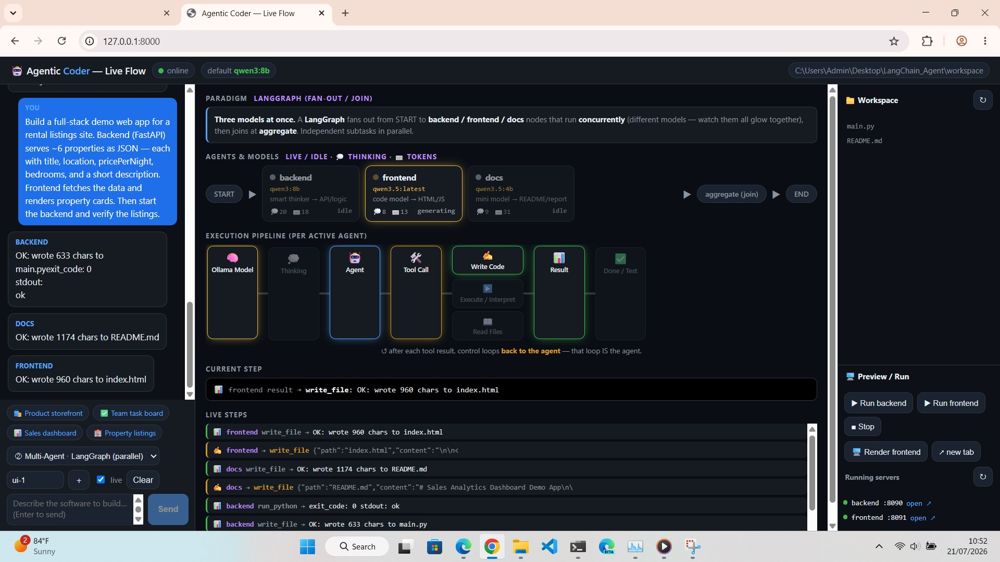

# LangChain Agent Visualizer

A local, backend **AI coding assistant** that demonstrates the modern LangChain
agent stack end-to-end and lets you **watch it work**:

- **LangChain 1.x** agents (`create_agent`) → **LangGraph** multi-agent graphs →
  **Deep Agents** (`create_deep_agent`) orchestration
- **FastAPI** + **Pydantic** API, with a single-page **Web UI** that animates the
  live flow (Ollama model → thinking → tool call → write/execute → result → done)
- **Local Ollama** models (remote server), one model per agent role
- Everything the agents do (write files, run code, start servers) is confined to
  `./workspace`

The agents can build **real full-stack demos** (FastAPI backend + HTML/JS frontend),
run them, and you can preview the rendered result in the UI.



---

## Architecture

```
                 Web UI (app/web/index.html)  ── live flow animation
                              │  SSE /chat/stream
                              ▼
        FastAPI (app/api/main.py)  ── Pydantic contracts, per-thread memory
                              │
        ┌─────────────────────┼──────────────────────────┐
   ① single              ② parallel                 ③ orchestrator
   create_agent      LangGraph fan-out          deepagents create_deep_agent
   (one ReAct loop)  backend‖frontend‖docs       orchestrator → planner →
                     run concurrently             coder → debugger → reporter
        └─────────────────────┴──────────────────────────┘
                              │  shared tools (app/tools/)
        filesystem (sandboxed) · python/node interpreters · shell
        start_backend / start_frontend / http_get / http_post
                              │
                     ChatOllama (remote), reasoning streamed
```

### The layers (read the code in this order)

| Stage | File | What it shows |
|------|------|---------------|
| 0 Config | `app/config.py` | `pydantic-settings`; `get_model()` factory (per-role model, `reasoning`, `num_ctx`, `num_predict`); `subprocess_env()` (run children in the conda env) |
| 1 Tools | `app/tools/filesystem.py`, `execution.py`, `servers.py` | Sandboxed file tools; python/node/shell runners; non-blocking server launchers + `http_get`/`http_post` |
| 2 Single | `app/agents/single_agent.py` | `create_agent` — the ReAct loop |
| 3a Parallel | `app/agents/parallel.py` | Raw **LangGraph** fan-out/join — `backend`/`frontend`/`docs` run **concurrently**, each a different model |
| 3b Orchestrator | `app/agents/orchestrator.py` | **Deep Agents** — orchestrator delegates via `task()` to `planner/coder/debugger/reviewer/reporter` |
| 4 API | `app/schemas.py`, `app/api/main.py` | FastAPI + Pydantic; `/chat`, SSE `/chat/stream`; preview + server-run endpoints |
| 5 Web UI | `app/web/index.html` | Per-mode diagram, live per-model streaming, workspace browser, run/preview |

---

## Setup

Uses a **remote Ollama server** (models run there) and a **conda env with Python
3.12** (`deepagents` needs Python ≥ 3.11).

```powershell
# 1. Env + deps
conda create -n agentic python=3.12 -y -c conda-forge --override-channels
conda run -n agentic pip install -r requirements.txt

# 2. Config
copy .env.example .env    # already points at the remote Ollama + assigns models

# 3. Run the API + Web UI (one process serves both — no npm, no build step)
conda run -n agentic python run.py
```

- **Web UI:** http://127.0.0.1:8000  •  **API docs:** http://127.0.0.1:8000/docs
- Optional smoke test: `conda run -n agentic python smoke_test.py`

> Each shell is fresh — either `conda activate agentic` first, or prefix commands
> with `conda run -n agentic ...`.

---

## Models (one per role)

All are local models on the remote Ollama server. Set in `.env` / `app/config.py`.

| Role | Model | Why |
|------|-------|-----|
| Single agent | `qwen3:8b` | strong coder + tool caller |
| **Orchestrator** | `qwen3:8b` (thinking off) | decisive `task()` caller — drives the pipeline |
| **Planner** | `qwen3.5:latest` (thinking off) | architect only — hard "no code" guardrail |
| **Coder** | `qwen3.5:latest` | the smart thinker writes the code |
| **Debugger** | `qwen3.5:latest` | runs + verifies + fixes |
| **Reviewer / Reporter** | `qwen3.5:4b` | review / README / text |

Parallel mode runs **3 distinct models at once**: `backend`=`qwen3:8b`,
`frontend`=`qwen3.5:latest`, `docs`=`qwen3.5:4b`.

---

## The Web UI — learning by observing

Open http://127.0.0.1:8000. Pick a mode (bottom-left), a preset, and **Send**.

- **Pipeline** lights up per SSE event:
  `🧠 Model → 💭 Thinking → 🤖 Agent → 🛠️ Tool → (✍️ Write | ▶️ Execute | 📖 Read) → 📊 Result → ↺ loop → ✅ Done`
- **Per-model view:** each agent node shows its model + live/idle + 💭thinking / ⌨️token counters, so you see which model is generating.
- **Per-mode diagram** from `GET /api/topology?mode=` (ReAct loop / LangGraph DAG / DeepAgents tree).
- **Business presets:** 🛍️ Product storefront · ✅ Team task board · 📊 Sales dashboard · 🏨 Property listings.
- **Run & preview:** **Run backend** / **Run frontend** launch the built app on their own ports (8090 / 8091); **Render frontend** shows the page in an iframe with live data (its `/api/*` is proxied to the running backend).
- **`thread_id`** = conversation memory; **workspace browser** flashes new files.

### Live thinking (why the UI feels alive)
`ollama_reasoning=True` streams the model's reasoning (Ollama `think:true`) as
`thinking` events. Without it, qwen3 "thinks" silently ~14 s then answers, so the
UI looks dead until Done.

---

## Full-stack contract

For any web app, all modes use one testable contract so backend + frontend + the
verifier agree:

- **Backend** `main.py`: FastAPI with `@app.get('/api/data')` → JSON list of demo objects.
- **Frontend** `index.html` (includes `<script src="index.js">` + a container) + `index.js` that `fetch('/api/data')` and renders, using the **same field names** the backend returns.
- **Verify:** `start_backend(port=8090)` → `http_get('http://127.0.0.1:8090/api/data')`.

---

## API endpoints

| Method | Path | Purpose |
|--------|------|---------|
| GET | `/` | Web UI |
| GET | `/health` | status + active model + workspace |
| POST | `/chat` | run to completion, return final reply |
| POST | `/chat/stream` | SSE: `thinking` / `token` / `tool_call` / `tool_result` / `delegate` / `error` / `done` |
| GET | `/api/topology?mode=` | graph shape + per-node model for the UI |
| GET | `/api/files`, `/api/file?path=` | list / read workspace files |
| POST | `/api/run/{backend,frontend,stop}` | launch/stop the built app |
| GET | `/api/servers` | running background servers |
| GET | `/preview/*` | serve the built frontend |

---

## Notes / guardrails
- File ops are path-confined to `./workspace`; subprocesses run in `cwd=workspace`
  with a timeout (`EXEC_TIMEOUT`) **inside the conda env** (`subprocess_env()` puts
  `fastapi`/`uvicorn` on PATH). Raw shell can be disabled with `ALLOW_SHELL=false`.
- Port **8000 is reserved** for the control API — `start_backend` forces 8090.
- Runs are bounded: `recursion_limit=35`, `num_predict` cap, and `/chat/stream`
  always emits `done` (even on error). If a run stalls, it ends on its own.
- Small local models are variable. Reliability tricks in use: the orchestrator is
  centered on the **`write_todos` checklist** (keeps it delegating through all
  steps); the planner is forbidden to write code; the coder writes all files in
  one task; field names are enforced. See `CLAUDE.md` for the full rationale.
- Arbitrary code execution — run only on trusted machines. Memory is in-process
  (`MemorySaver`); swap a SQLite/Postgres checkpointer for persistence.
